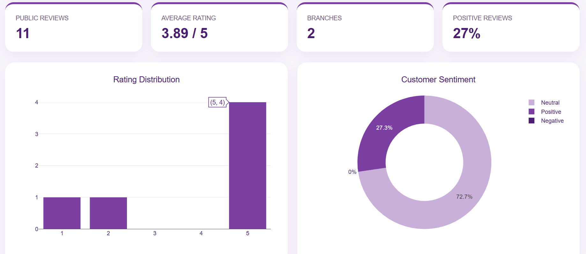

# Sugreve Customer & Product Intelligence Dashboard

An independent portfolio dashboard exploring how public customer reviews, branch details, product listings, and pricing can be turned into clear business insights for a Pakistani bakery like Sugreve.

**Note:** This is an unaffiliated personal project built to demonstrate data analysis and dashboard design skills. It is not an official Sugreve product, and it is based only on publicly available information.

## 🔗 Live Demo
[View Live Dashboard](https://samiah2004.github.io/Sugreve-Customer-Product-Intelligence/
)

## 📸 Preview

## Problem
Bakeries sell many products across several branches, but owners often lack a clear, visual way to see which products customers love, how items are priced, what customers complain about, and which branches need attention, all in one place.

## Features
- KPI cards (e.g., average rating, number of reviews, number of products, number of branches)
- Product and pricing overview
- Customer review and sentiment analysis (common praise and complaints)
- Branch-level comparison
- Filterable data views
- Responsive design

## Data
- **Source:** Publicly available information (customer reviews, branches, product listings, and prices)
- **Collected:** [Month, Year]
- **Records:** [number of reviews / products / branches]
- No private or confidential information was used.

## Built With
- HTML5
- CSS3
- JavaScript
- [Add Python / Excel / SQL / Power BI if you used them for cleaning or analysis]

## How to Run
Clone the repo and open `index.html` in your browser, or view the live demo link above.

## What I Learned
Over 5 days, I cleaned public review, branch, and pricing data and turned it into a dashboard a non-technical bakery owner could understand. I learned to choose metrics that answer real business questions (what sells, what customers complain about, which branch needs help) rather than showing every chart possible, and to design a layout where the most important numbers are visible first.

## Contact
**Samiah, Data & Finance Analyst**
- LinkedIn: [your link]
- Email: [your email]

Want a dashboard like this for your business? Feel free to get in touch.
